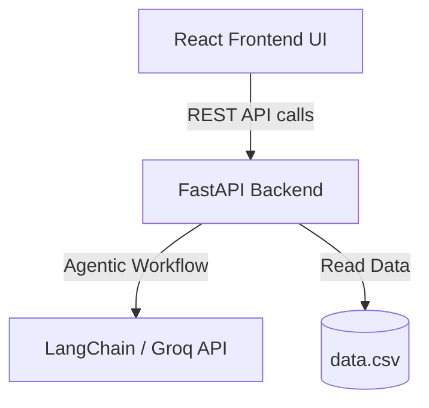
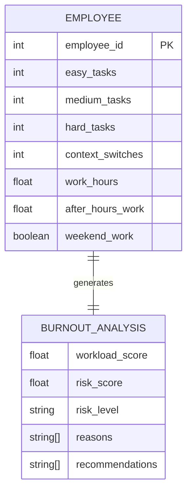
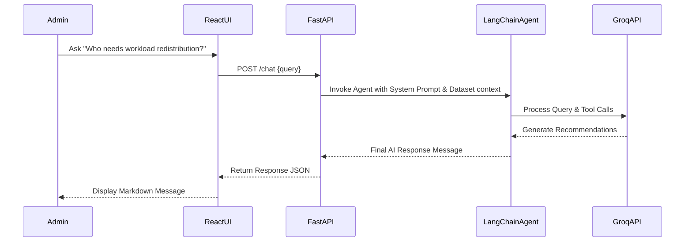

# High-Level Design (HLD) - Google Stitch (Burnout Risk Analyzer)

## 1. Introduction
### 1.1 Purpose
This document outlines the High-Level Design (HLD) for the **Google Stitch (Burnout Risk Analyzer)** project. It serves as a comprehensive guide for developers, stakeholders, and HR managers to understand the system's architecture, components, and data flow.

### 1.2 Scope
The system evaluates employee task data, working hours, and context-switching metrics to predict burnout risk using a scoring model. Additionally, it features an interactive, AI-driven chatbot powered by LangChain and the Groq LLM to deliver actionable recommendations for workload management.

### 1.3 Definitions, Acronyms, Abbreviations
- **API**: Application Programming Interface
- **LLM**: Large Language Model
- **ML**: Machine Learning
- **HR**: Human Resources
- **ReAct**: Reason and Act (Agent framework)

### 1.4 References
- System Requirements Specification
- `data.csv` (Employee dataset)
- FastAPI and React project documentation

---

## 2. System Overview
### 2.1 Problem Statement
HR teams currently lack data-driven tools to preemptively identify employee burnout. Traditional methods rely on manual spreadsheet analysis or subjective surveys, resulting in delayed interventions and decreased employee well-being.

### 2.2 Proposed Solution
Google Stitch acts as an AI-powered portal that ingests employee workload data, calculates objective burnout risk scores, and offers dynamic mitigation strategies via an interactive AI assistant.

### 2.3 Goals & Objectives
- Automate burnout risk detection using quantifiable workload metrics.
- Provide clear, data-driven recommendations to reduce burnout.
- Offer a conversational interface to seamlessly query employee wellness data.

### 2.4 Assumptions & Constraints
- **Tech Stack**: FastAPI (Backend), React (Frontend), LangChain/Groq (LLM).
- **Constraints**: 
  - Requires internet access for LLM external API calls.
  - Core data is currently stored in a local CSV file, pending future database migration.

---

## 3. System Architecture
### 3.1 Architecture Diagram

### 3.2 Technology Stack
- **Frontend**: React.js, Vite
- **Backend**: FastAPI, Python, Pandas, Uvicorn
- **AI**: LangChain, Groq API (llama-3.3-70b-versatile)

### 3.3 Design Approach
- **Client-Server Architecture**: Strict separation of concerns between the React user interface and the FastAPI backend.
- **RESTful API**: Stateless API endpoints for fetching bulk analysis (`/analyze_all`) and individual records (`/analyze/{id}`).
- **Agentic AI Pattern**: Implementation of a ReAct agent equipped with context-aware tools.

### 3.4 Deployment View
- **Local Machine Deployment**:
  - Frontend hosted locally on port `5173`.
  - Backend served via Uvicorn on port `8000`.

---

## 4. Database Design
*(Note: The system currently utilizes flat-file CSV storage. Below is the logical schema representation.)*

### 4.1 ER Diagram

### 4.2 Table Schema
- **Employee**: `employee_id` (PK, Integer), `easy_tasks` (Integer), `medium_tasks` (Integer), `hard_tasks` (Integer), `context_switches` (Integer), `work_hours` (Float), `after_hours_work` (Float), `weekend_work` (Boolean).

### 4.3 Data Dictionary
- `employee_id`: Unique identifier assigned to each employee.
- `context_switches`: Number of times an employee shifts focus between disparate tasks during a shift.
- `workload_score`: A calculated metric weighting task volumes by difficulty.
- `risk_score`: Heuristics/ML-predicted value indicating burnout severity.
- `risk_level`: Categorical output (`Low`, `Medium`, `High`) derived from the risk score.

---

## 5. Functional Flow
### 5.1 Use Case Diagram
- **Actors**: HR Admin / Manager
- **Core Use Cases**:
  1. View the complete team risk dashboard.
  2. View detailed risk breakdown and metrics for a specific employee.
  3. Chat with the AI assistant for customized team insights and recommendations.

### 5.2 Activity Diagrams
**Analyze Employee Flow**:
1. Admin opens the dashboard in the browser.
2. Frontend requests data via `/analyze_all`.
3. Backend ingests `data.csv` and executes the `calculate_burnout_risk` pipeline.
4. Data is weighted, inferenced, and returned to the UI.
5. Admin views categorized risks.

### 5.3 Sequence Diagrams
**AI Chat Interaction**:

---

## 6. Wireframes
### User Interface Flow
- **Dashboard View**: A grid or table displaying employees, highlighting their predicted Risk Level (color-coded).
- **Detail Modal**: Selecting an employee reveals a detailed breakdown of their Workload Score, Reasons for burnout, and specific Mitigation Recommendations.
- **AI Chat Panel**: A persistent chat interface where users can submit natural language queries to the LangChain agent for deeper analysis.

---

## 7. Non-Functional Requirements
### 7.1 Security
- **API Protection**: Sensitive keys (`GROQ_API_KEY`) are managed via environment variables and never exposed to the client.
- **Access Control**: CORS middleware is strictly configured to manage origin access.

### 7.2 Scalability
- **Current Limitation**: In-memory data processing limits horizontal scaling for massive datasets.
- **Future Migration Path**: Transition from CSV to an RDBMS (e.g., PostgreSQL or SQLite) to handle concurrency.

### 7.3 Usability
- **Responsiveness**: The React frontend must adapt cleanly to different screen sizes.
- **Clarity**: Complex AI outputs must be parsed into clean, readable Markdown format for the end user.

---

## 8. Risks & Mitigation
### Technical Risks
- **Data Concurrency & File Locking**:
  - *Risk*: Manual DB (CSV) does not natively handle concurrent read/writes.
  - *Mitigation*: Planned architectural update to migrate to SQLite for built-in concurrency control.
- **Third-Party API Dependency**:
  - *Risk*: Dependency on the external Groq API subjects the app to rate limits and downtime.
  - *Mitigation*: Implement robust error handling (`try/catch`) in the `/chat` endpoint to return graceful fallback messages.
